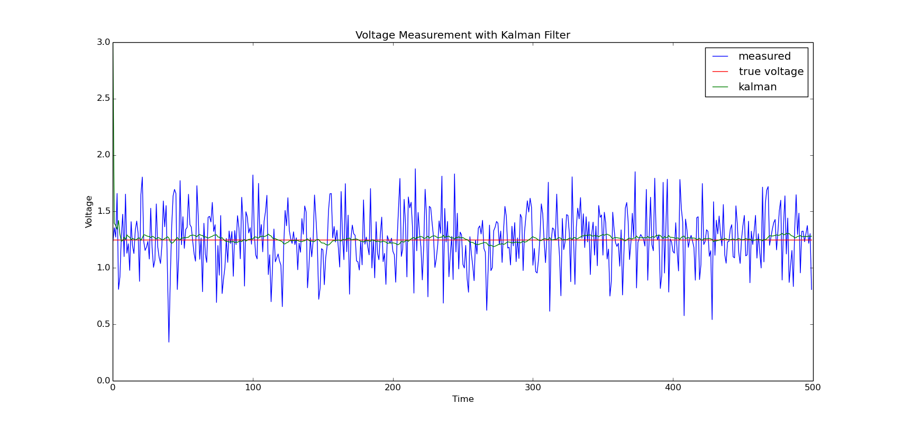

# Kalman-Filter-using-Boost-CPP

This is for my mini project.

Implementation of simple kalmanfilter using boost c++ libraries

This is a simple demonstration of how to use boost cpp libraries.

I have used the example of a singular kalman filter as explained beautifully by  Greg Czerniak's Website.
[Article can be found here](http://greg.czerniak.info/guides/kalman1/)

Will be posting a detailed version soon.

### Project Arch : 

KalmanFilter : Contains code in C++ 
plot : contains a python script to plot the output
KalmanFilter/compile.sh : To compile the code. 

Or Simply run

`g++  main.cpp  -std=c++11`

`./a.out `

### Dependencies : 
[Boost Cpp libraries](http://www.boost.org)

### Output :

